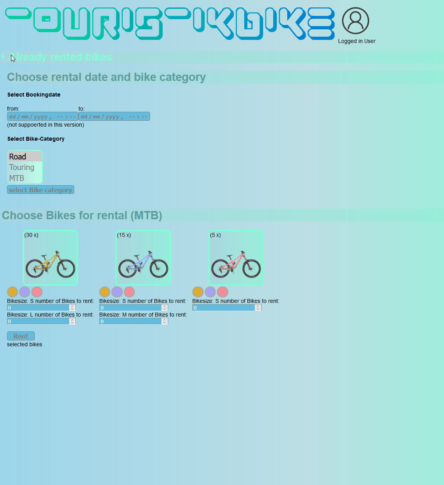
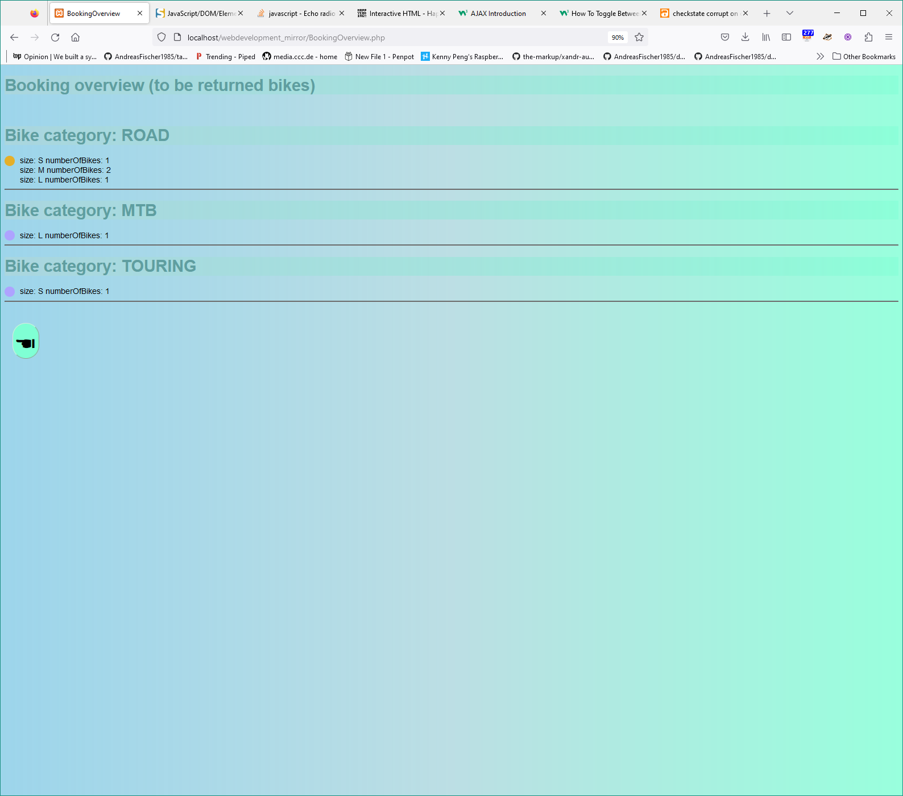

### Implementing a case study platform for renting bikes
While doing so, learning the basics of "web development", e.g.:
- php
- CSS
- HTML
- XML
- JS

## "Features":
- centralized Color(resource) management
- dedicated user vs bikeStock „database“ (xml)
- dynamically colored bike variants
- collapsible „rented bikes“ overview (CSS-only)
  - number of to be returned bikes limited by „RENTED“-tag in user.xml
- own favicon
- ways of interacting with the booking system:
  - return bike
  - rent bike
- customized RadioButton for selecting the variant → describe how :before and „inner“/“inside“ is working

# landing page booking

# overview of current booking-state ("cart")
