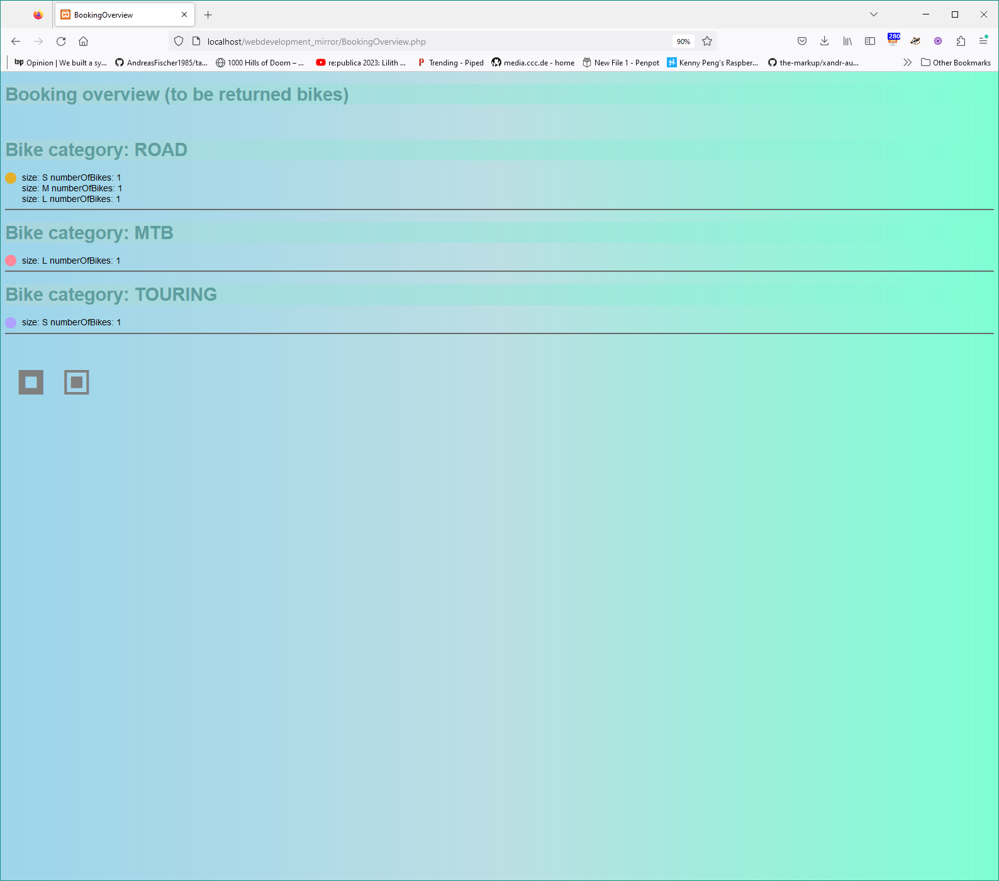

### Implementing a case study platform for renting bikes
## "Features":
- dymacally colored bike (preview) images
- (color)ressources defined in a central place (ColorDefinitions)
- "database" (user.xml) data is being used for retrieving the number of already rented / available bikes
- collapsible "already rented" section

# landing page booking

# overview of current booking-state ("cart")
